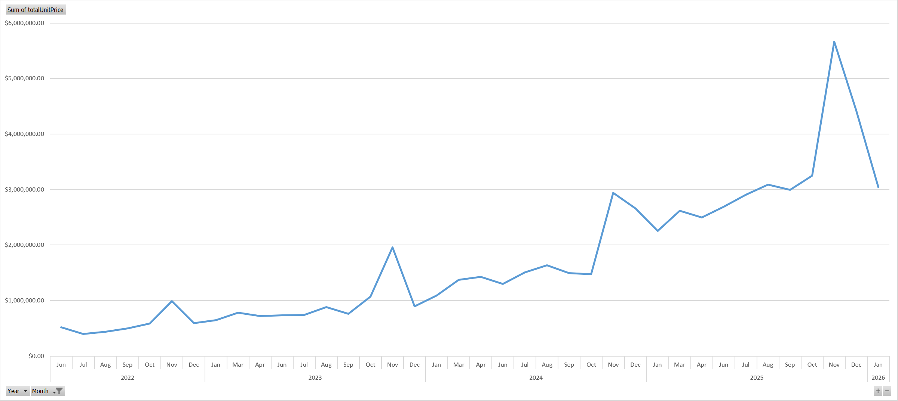
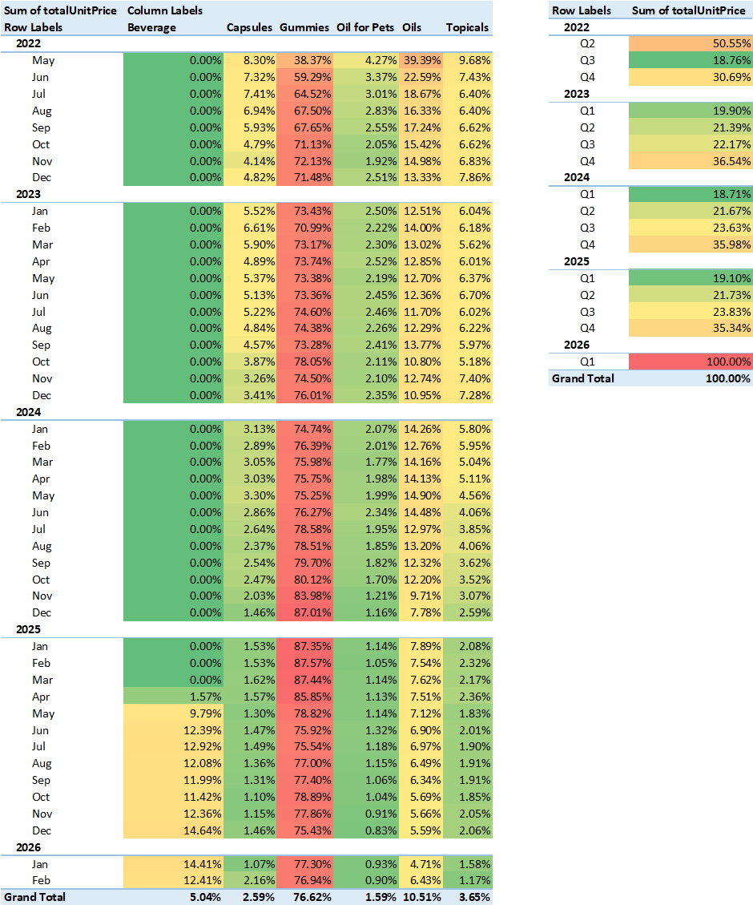
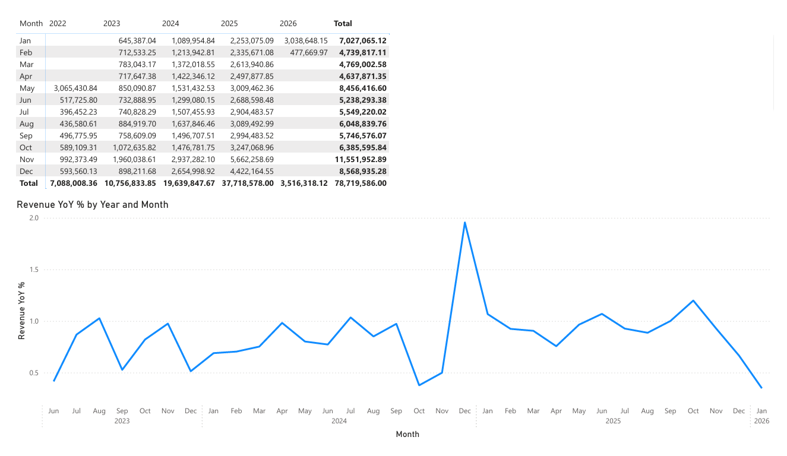

# Ecommerce Revenue & Product Mix Analysis

## Executive Summary

This project analyzes multi-year ecommerce transaction data to understand revenue growth drivers, product mix trends, seasonality patterns, and pricing behavior. The dataset contains over **1.9 million order item records and more than 1 million orders**, providing a realistic simulation of production-scale ecommerce data.

The project follows a full data workflow including **data engineering, exploratory analysis, dashboard reporting, and predictive modeling** to transform raw ecommerce transaction data into actionable business insights.

### Key Findings

- **Strong revenue growth:** Total revenue increased from approximately **\$7.1M in 2022 to \$37.7M in 2025**, indicating rapid scaling of the business.
- **High product concentration:** Approximately **76% of total revenue is driven by a single product category (Gummies)**, creating significant dependency on one product line.
- **Strong seasonal demand:** Revenue is heavily concentrated in **Q4 (≈35% of yearly revenue)**, driven by holiday purchasing behavior.
- **Price changes across product lines:** Capsule prices dropped significantly between **Nov 2025 and Jan 2026**, while oil product prices gradually normalized from ~\$85 to ~\$55.
- **Promotional items in data:** Nearly **500k transactions show \$0 pricing**, largely representing promotional or free items (cards, influencer boxes, stickers).

### Forecasting Insights

A time-series forecasting model was developed using **Prophet** to estimate future revenue trends.

The model captures long-term revenue growth and seasonal purchasing patterns, achieving approximately **15–18% forecasting error (MAPE)** under cross-validation.

Residual diagnostics revealed that the largest forecasting errors occur during **short-lived promotional events**, particularly in late November. These spikes correspond with increased discount activity and marketing campaigns, indicating that **promotion-driven demand volatility is a key driver of revenue fluctuations**.

### Business Implications

These findings highlight several potential operational risks and strategic opportunities:

- **Product concentration risk** if demand for the primary product category declines.
- **Seasonal revenue volatility** due to heavy reliance on holiday demand.
- **Promotion-driven demand spikes** that create forecasting uncertainty.
- **Potential margin pressure** resulting from price adjustments in key product categories.
- **Data quality considerations** when analyzing promotional products and $0 transactions.

This project demonstrates how analysts can transform raw ecommerce transaction data into business insights while also building predictive models to forecast future performance.

## Dashboard Highlights

### Revenue Growth Over Time

Monthly revenue trends reveal strong growth beginning in late 2023 and accelerating through 2025, with clear seasonal spikes during the holiday months.



---

### Revenue Contribution by Product Category

Product contribution analysis shows that **Gummies dominate revenue**, increasing their share over time while other product categories decline.



---

### Power BI Dashboard Overview

The Power BI dashboard provides an interactive overview of revenue trends, product performance, price changes, and order volume across time.



---

# Dataset

The dataset represents ecommerce transaction activity across several years and includes orders, customers, and item-level purchase details.

### Tables

| Table | Rows |
|------|------|
| Customers | 326,673 |
| Orders | 1,018,641 |
| Order Items | 1,901,304 |

The data spans **2022–2026** and contains over **1.9 million item-level transactions**.

All sensitive fields were anonymized before publication.

---

# Data Engineering & Cleaning

The raw export contained several common issues seen in real production datasets.

## Data Structure Issues

- Data initially arrived in a **single flat structure**
- Several columns contained **nested JSON objects**
- Product attributes were embedded inside JSON fields
- Time columns contained duplicates

## Cleaning Steps

### Data extraction
- Parsed JSONL product fields using Python
- Converted nested structures into structured columns

### Data modeling
Split dataset into relational tables:

- `customers`
- `orders`
- `order_items`

### Power Query transformations

- Flattened nested JSON columns
- Standardized product type labels
- Removed duplicate customers
- Created normalized product categories

### Date modeling

- Built a dedicated calendar table
- Standardized time columns

### Data quality issues discovered

- ~2% of `createdAt` timestamps missing
- ~500k order items with **\$0 prices**
- ~389k records missing standardized product type
- Several promotional products incorrectly labeled

Many of the $0 price items were verified to be **expected promotional products** (cards, influencer boxes, stickers).

---

# Tools Used

### Data Processing
- Python (JSONL → CSV conversion)
- Excel Power Query (ETL transformations)

### Data Modeling
- Power Pivot
- Relational modeling
- DAX measures

### Visualization
- Excel Pivot Tables
- Power BI dashboards

### Large Dataset Handling
- DAX Studio used to export large Power Pivot tables

---

# Key Business Analyses

## Revenue Trend Analysis

Revenue grew substantially from **2023 through 2025**.

The dataset shows strong scaling of monthly revenue with particularly large increases beginning in late 2024.

Total revenue across all years reached approximately **$78.7M**.

Monthly analysis shows:

- consistent upward trend through 2025
- major spikes during holiday months
- sharp drop immediately after holiday periods

---

## Seasonality

Quarterly analysis shows heavy revenue concentration in **Q4 each year**.

Typical pattern:

- Q1–Q3 relatively stable
- Q4 accounts for **~35% of yearly revenue**

This indicates strong **holiday-driven demand cycles**.

---

## Product Mix Analysis

Revenue is extremely concentrated in one product category.

### Product revenue share

| Product | Revenue Share |
|--------|---------------|
| Gummies | ~76% |
| Oils | ~10% |
| Capsules | ~2–8% |
| Oil for Pets | ~1–4% |
| Topicals | ~2–9% |

Over time, gummies increased from roughly **60–70% of revenue to over 85% in some months**.

This indicates growing **product concentration risk**.

---

## Revenue Contribution Trends

Contribution analysis revealed:

- Gummies steadily increasing market share
- Capsules and oils gradually losing share
- Minor products declining to negligible revenue

This suggests the company is increasingly dependent on a single product category.

---

## Pricing Trends

Product pricing analysis showed notable shifts across several product types.

### Oils
- Started around **\$85 average price**
- Gradually normalized to roughly **\$55**

### Capsules
- Major price drop between **Nov 2025 → Jan 2026**
- From ~\$60 to ~\$44

These price changes may indicate:

- promotional campaigns
- competitive price pressure
- margin adjustments

---

## Order Volume Trends

Order count analysis showed major volume spikes in **November and December**, reinforcing the strong seasonal demand pattern.

Monthly order counts exceeded **70k orders during peak holiday months**, indicating significant operational scaling during Q4.

---

# Key Business Risks Identified

## Product Concentration Risk

With roughly **76% of revenue coming from gummies**, the company is highly exposed to demand shifts in a single product category.

---

## Seasonal Revenue Volatility

Heavy dependence on Q4 revenue creates operational risk if holiday demand weakens.

---

## Price Compression

Large price drops in some categories may indicate margin pressure or competitive pricing pressure.

---

## Data Quality Risk

Promotional items and inconsistent product labeling can distort revenue analysis if not properly handled.

---

# Dashboard Overview

The Power BI dashboard explores several key analytical areas:

- Revenue growth trends
- Year-over-year revenue changes
- Product-level revenue trends
- Product pricing changes
- Order volume trends

Example dashboard views include:

- Monthly revenue breakdown
- Product contribution analysis
- Average product price by category
- Order count by product type

---
# Data Science: Revenue Forecasting

## Objective

Following exploratory analysis of revenue trends and seasonality, a forecasting model was developed to estimate future revenue growth and evaluate how well historical patterns explain demand.

The goals of this modeling phase were to:

- Forecast future ecommerce revenue
- Evaluate forecasting accuracy
- Diagnose where the model fails
- Identify drivers of demand volatility

---

## Forecasting Method

Revenue forecasting was performed using **Prophet**, a time-series forecasting library designed for business data with strong seasonal patterns.

Daily revenue was aggregated from item-level transactions and used as the input time series.

Prophet decomposes the time series into several components:
```
Revenue =
Trend
 + Weekly Seasonality
 + Yearly Seasonality
 + Residual Noise
```

This allows the model to capture:

- long-term revenue growth
- weekly purchasing behavior
- yearly holiday demand cycles

---

## Model Evaluation

Forecast accuracy was evaluated using Prophet's **time-series cross-validation**, which repeatedly trains the model on historical windows and predicts future periods.

Key evaluation metrics included:

| Metric | Description |
|------|------|
| MAE | Average absolute forecast error |
| RMSE | Root mean squared error (penalizes large mistakes) |
| MAPE | Mean absolute percentage error |
| Coverage | Percentage of observations within forecast intervals |

Example results from cross-validation:
```
MAPE ≈ 15–18%
MAE ≈ $11k–$13k average daily error
Coverage ≈ 80–85%
```

These results indicate the model predicts daily revenue within roughly **15–18% error**, which is typical for volatile retail demand.

---

## Residual Analysis

Residual diagnostics revealed several extreme outliers where:
```
Actual Revenue >> Predicted Revenue
```


These events correspond to **large demand spikes that the model failed to anticipate**.

Further investigation showed that these spikes consistently occur during **late November and early December**.

---

## Promotional Demand Effects

Earlier analysis of order behavior revealed that **discounted transactions increase significantly during the same period**.

This suggests that:
```
Promotional campaigns drive short-lived demand spikes
```

Because the baseline Prophet model only captures **trend and seasonal patterns**, it cannot anticipate these promotion-driven events.

This explains the large positive residuals observed during peak demand days.

---

## Forecast Interpretation

Although individual daily predictions can contain large errors during promotional events, the model performs well when revenue is aggregated over longer periods.

When forecasts are grouped by month, the model captures overall revenue growth and seasonal demand patterns effectively.

For strategic planning, **monthly and yearly forecasts provide more reliable insight than individual daily predictions**.

---

## Key Modeling Insight

The forecasting model successfully captures long-term revenue growth and seasonal demand patterns but underestimates short-term spikes caused by promotional activity.

This highlights an important limitation of baseline time-series models:

> Revenue volatility in ecommerce is often driven by marketing campaigns and promotional events that are not encoded in historical seasonality.

Incorporating promotional indicators or marketing campaign data would likely improve forecast accuracy.


# Key Skills Demonstrated

- Data cleaning & transformation
- Handling nested JSON data
- Relational data modeling
- Large dataset handling
- Business-focused exploratory analysis
- Dashboard design
- Risk-focused business interpretation
